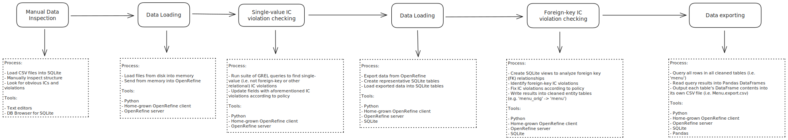
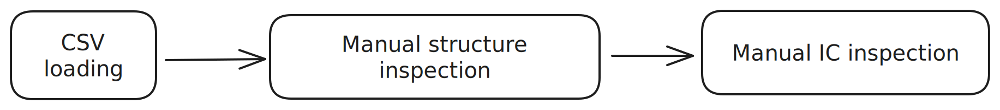
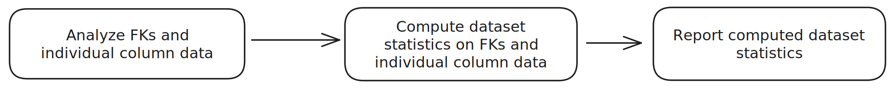
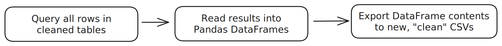

# CS 513 Group Project, Part 2

**Team ID**: 37

__Team Name__: PADS

Aaron Schlesinger and David Pankros

{aschle2, pankros2}@illinois.edu

## 1. Description of Data Cleaning Performed

### Identify and describe all (high-level) data cleaning steps you have performed.

We've used OpenRefine and a SQL database together to achieve data cleaning outcomes that are more complex than OpenRefine would easily allow us to do on its own. We've also managed to build a Python client for OpenRefine's API.

Instead of using the OpenRefine dashboard to perform data cleaning steps visually with the point-and-click user interface, we're able to integrate all our data cleaning steps, listed below, into a single Python program that can be run from the command line.

- Raw CSV manipulation
- Loading CSV data into OpenRefine
- Manipulating data in OpenRefine
- Loading partially-cleaned data into the SQL database
- Constructing specific views of data in SQL
- Manipulating data in SQL
- Exporting cleaned data from SQL to final, cleaned data in CSV format

The result of the single, unified Python program is that we have the ability to run our entire workflow, including all outer and inner workflow steps, with a single command. This ability to run the entire workflow with a single command is a significant advantage over running the workflow manually, step-by-step, in OpenRefine and SQL and gives us the ability to easily and efficiently reproduce our results, iterate, and improve our data cleaning process.

### For each high-level data cleaning step you have performed, explain its rationale. Was the step really required to support use case U1? Explain. If not, explain why those steps were still useful.

For context, use case `U1` is summarized as using standard data cleaning techniques to produce data to be used for non-production-critical applications, data mining, unsupervised learning, or possibly further analysis and manipulation to use cleaner subsets of the entire dataset for additional purposes.

We have listed the high-level data cleaning steps in the introduction to this section. We will re-list them below and explain the rationale for each step.

#### Step 1: Raw CSV manipulation

This step is primarily loading CSV data into memory, for the purpose of subsequently loading it into OpenRefine. We do
no data cleaning in this step, but it is necessary to support all the subsequent steps.

#### Step 2: Loading CSV data into OpenRefine

Similarly to the previous step, we do not perform any data cleaning in this step. Loading data into OpenRefine is
necessary to support all OpenRefine-based and subsequent cleaning steps.

#### Step 3: Manipulating data in OpenRefine

After data are loaded into OpenRefine, we do many data cleaning steps that do not involve foreign key or other
relational integrity constraint (IC) violations. All transforms are done with
OpenRefine's [GREL language](https://openrefine.org/docs/manual/grelfunctions).

These transforms are necessary for use case `U1` because they greatly improve the standardization and cleanliness of
individual fields in the dataset, which is important for all `U1` applications, but especially user-facing ones. They
also better prepare the data to be analyzed and manipulated further, another `U1` goal. The transforms we do in this
step correspond to some, but not all of the IC violations in
the [`part_2/ic.md`](https://github.com/dpankros/uiuc_cs513_project/blob/main/part_2/ic.md) file in the repository, so
we make progress toward completing our IC violations checks in this step.

We also perform crucial data cleaning that is unrelated to our IC violations checks, but does enable us to complete
additional IC violations checks in subsequent steps. For example, one of the non-IC cleaning steps we take herein
establishes a common vocabulary for the `Menu.venue` column and transforms all uncleaned values in that column to that
common vocabulary. This step allows us to group by values in this column much more effectively in subsequent steps.

##### List of IC violations checks

###### `Dish`

| Column           | IC description                                                       |
|------------------|----------------------------------------------------------------------|
| `id`             | Must be populated and unique                                         |
| `name`           | Must be populated                                                    |
| `menus_appeared` | Should be greater than 0                                             |
| `times_appeared` | Should be greater than 0                                             |
| `lowest_price`   | Should be > 0                                                        |
| `highest_price`  | should not be non-`NULL` and greater than or equal to `lowest_price` |

###### `Menu`

| Column                 | IC description                                             |
|------------------------|------------------------------------------------------------|
| `id`                   | Must be populated and unique                               |
| `name`                 | Must be populated                                          |
| `physical_description` | Must be a list of string demlimited by semicolons          |
| `date`                 | Must be in iso8601 format                                  |
| `status`               | Must be one of the two values `complete` or `under review` |
| `page_count`           | Must be greater than 0                                     | 
| `dish_count`           | Must be greater than 0                                     |

###### `MenuPage`

| Column        | IC description                         |
|---------------|----------------------------------------|
| `id`          | Must be populated and unique           |
| `menu_id`     | Must be defined and menu.id must exist |
| `full_height` | Must be greater than 0                 |
| `full_width`  | Must be greater than 0                 |

###### `MenuItem`

| Column         | IC description                                               |
|----------------|--------------------------------------------------------------|
| `id`           | Must be populated and unique                                 |
| `menu_page_id` | Must be defined and `menu_page.id` must exist                |
| `price`        | Must be greater than 0 or `NULL`                             |
| `dish_id`      | Must be defined in `dish.id` or `NULL`                       |
| `created_at`   | Should be in iso8601 format and represent a time in the past |
| `updated_at`   | Should be in iso8601 format and represent a time in the past |

#### Step 4: Loading partially-cleaned data into the SQL database

After we finish running all the GREL/OpenRefine-based transforms, we consider our data partially cleaned, since we have
not addressed relational IC violations like foreign key constraints. Since SQL excels at analyzing, reporting on, and
fixing these relational IC violations, our next step is to load all our partially-cleaned data from OpenRefine into a
SQLite database.

We do no cleaning in this step, but it's necessary for our subsequent foreign key IC violations cleaning work.

#### Step 5: Constructing specific views of data in SQL

After loading our partially-cleaned data into the SQL database, we construct specific views of the data that allow us to
analyze and report on the data in ways that are possible in neither OpenRefine, nor the raw `Menu`, `Dish`, `MenuItem`,
nor `MenuPage` tables individually. Most of these views are constructed by joining at two or more of these tables
together to examine one or more specific foreign key relationships.

Using these views, we're able to easily identify and fix all rows that violate a specific foreign key IC violation. We
do no actual data cleaning in this step, but like the previous step, this step is required for subsequent foreign key IC
violations cleaning work.

#### Step 6: Manipulating data in SQL

Armed with partially-cleaned data in our "base" `Menu`, `Dish`, `MenuItem`, and `MenuPage` tables and our constructed
views, we can now fix foreign key IC violations based on some policy. Policies vary, but in general, we want to ensure
that all foreign key relationships are valid, so if we find an invalid foreign key, we simply set that value to `NULL`.

This work is necessary for use case `U1` because it ensures there are no invalid foreign key relationships in the
dataset, a feature especially valuable for the user-facing applications described in `U1` or any other application that
queries or analyzes these data based on relationships between tables.

#### Step 7: Exporting cleaned data from SQL to final, cleaned data in CSV format

This final step is relatively simple, but critical to transform our cleaned dataset to the same format in which we got
it. At this point, we have a cleaned dataset in SQL tables and in this step, we export these tables to individual CSV
files. The mapping from SQL table to exported CSV files is as follows:

- `menu` -> `Menu.export.csv`
- `dish` -> `Dish.export.csv`
- `menu_item` -> `MenuItem.export.csv`
- `menu_page` -> `MenuPage.export.csv`

## 2. Document data quality changes

### Quantify the results of your efforts, e.g., by providing a summary table of changes: Which columns changed? How many cells (per column) have changed, etc.?

There are several measures we use to quantify the results of our efforts, described in the sections herein.

#### Aside: Full run histories

We have performed several data cleaning runs on the NYPL restaurants dataset with our software as it has evolved. Full
output from these runs can be found in the [`runs/`](https://github.com/dpankros/uiuc_cs513_project/tree/main/runs)
directory in the repository. Each individual run is stored in each file therein, and file names indicate the date and
time the run was completed. Runs prior to the latest one may have different output if they were done with prior versions
of the software. The structure of each filename is as follows:

```text
YYYY-MM-DD.HH-MM-SSZUTC.csv
```

#### IC Violations

As may be obvious, it's important that our cleaning is able to ameliorate at least most of the IC violations in the
dataset. We have a wide range of IC checks in our Python application, and we have run these checks before and after
cleaning to ensure that we have removed most or all IC violations. The below table contains a very high-level summary of
IC violations before and after cleaning. As can be seen below, the IC violations measured by the table have been
removed.

| Data entity | # IC violations before cleaning | # IC violations after cleaning | Columns changed                                      |
|-------------|---------------------------------|--------------------------------|------------------------------------------------------|
| `MenuItem`  | 370                             | 0                              | `price`, `dish_id`                                   |
| `MenuPage`  | 5803                            | 0                              | `menu_id`                                            |
| `Dish`      | 67668                           | 0                              | `first_appeared`, `last_appeared`, `times_appeared`  |
| `Menu`      | 17541                           | 0                              | `menu_id`, `full_height`, `full_width`, `page_count` |

#### Distinct values

Since the original dataset had many columns with malformed, or inconsistently formatted values, we have spent significant effort standardizing these values. Thus, an important measure to determine whether this dimension of our cleaning has been successful is how much we've reduced the number of distinct values in each column after cleaning. The sections herein show that we have been successful in reducing the number of distinct values in many columns.

##### `Dish`

| Column         | Count Before | Count After | Count Impr | Min Before | Min After  | Max Before | Max After  | Avg Before | Avg After |
|----------------|--------------|-------------|------------|------------|------------|------------|------------|------------|-----------|
| name           | 418542       | 343370      | 18.0%      |            |            |            |            |            |           |
| menus_appeared | 423397       | 423397      | 0.0%       | 0.0        | **1.0**    | 7740.0     | 8459.0     | 3.1        | 3.2       |
| times_appeared | 423397       | 423397      | 0.0%       | -6.0       | **1.0**    | 8484.0     | 8484.0     | 3.1        | 3.2       |
| first_appeared | 423397       | 378448      | 10.6%      | **0.0**    | **1852.0** | **2928.0** | **2024.0** | 1675.5     | 1927.7    |
| last_appeared  | 423397       | 378448      | 10.6%      | **0.0**    | **1852.0** | **2928.0** | **2024.0** | 1679.3     | 1930.8    |
| lowest_price   | 394297       | 285647      | 27.6%      | 0.0        | 0.0        | 1035.0     | 180000.0   | 1.0        | 29.5      |
| highest_price  | 394297       | 285647      | 27.6%      | 0.0        | 0.0        | 3050.0     | 180000.0   | 1.6        | 36.6      |

- `name` has had similar names normalized and clustered resulting in an 18% decrease in unique values.
- `description` wasn't changed
- `menus_appeared` and `times_appeared` were re-caclulated based on the menus/menu_items/menu_pages actually in the data. Thus, zero is no longer a viable result and neither are negative numbers. The semantic difference between these two columns remains somewhat unclear.
- `first_appeared` and `last_appeared` similarly were drawn from actual data from menus/menu_items/menu_pages but it was clear that not all the values contained there are accurate. The data were examined and the true range of values _appeared to be_ between 1852 and 2024. These values were, thus, constrained to be in this range.
- `lowest_price` and `highest_price` were re-caclulated based on the menus/menu_items/menu_pages. While the statistics above a truncated to one decimal point. The actual values are greater than zero, albeit small -- 0.01 and 0.005,respectively.

##### `Menu`

| Column               | Count Before | Count After | Count Impr |
|----------------------|--------------|-------------|------------|
| name                 | 793          | 752         | 5.2%       |
| sponsor              | 6366         | 5929        | 6.9%       |
| event                | 1769         | 1670        | 5.6%       |
| venue                | 233          | 148         | 36.5%      |
| place                | 3743         | 3344        | 10.7%      |
| physical_description | 4507         | 4163        | 7.6%       |
| occasion             | 381          | 286         | 24.9%      |
| notes                | 9380         | 9362        | 0.2%       |
| call_number          | 15936        | 15936       | 0.0%       |
| date                 | 6599         | 6599        | 0.0%       |
| location             | 6279         | 6227        | 0.8%       |
| currency             | 42           | 42          | 0.0%       |
| currency_symbol      | 34           | 34          | 0.0%       |
| status               | 2            | 2           | 0.0%       |

- `name` had its values normalized and clustered to find duplicate values'
- `sponsor` was minimally modified to merge values that differed in case.
- `event` is a multi-valued tag-like list of values. These values were normalized and marged to attempt to reduce the
  cardinality of possible values presented.
- `venue` were categorical values with many slight differences. These were merged as much as could reasonably be performed.
- `place` had its values converted to standard casing, had various delimiters normalized or removed (i.e. `[PHILADELPHIA, PA.]` converted to `Philadelphia, Pa`), had minor punctuation removed where appropriate, and had other minor inconsistencies removed and standardized
- `physical_description` - had delimiter formatting standardized to internal semicolon (`;`) separation, with no trailing semicolon character. All text in this column was also converted to lowercase
- `occasion` is a multi-valued tag-like list of values. These values were normalized and marged to attempt to reduce the
  cardinality of possible values presented.
- `notes` are, if they can believed to be notes, freeform values that are not meant to be generalized. Thus notes had
  their delimiters normalized for later formatting, but had very little other changes performed.
- `call_number` is suspected to be a library call number and, because the acceptable formats of this value are unclear,
  was left unchanged.
- `keywords` was removed as it was unused.
- `language` was removed as it was unused.
- `date` was left unchanged.
- `location` was normalized to make its format consistent.
- `location_type` was removed as it was unused.
- `currency` appeared consistent and was left unchanged.
- `currency_symbol` appeared consistent and was left unchanged.
- `status` was already two distinct values and was left unchanged.
- `page_count`
- `dish_count`

##### `MenuItem`

| Column     | Count Before | Count After | Count Impr | Min Before | Min After | Max Before | Max After | Avg Before | Avg After |
|------------|--------------|-------------|------------|------------|-----------|------------|-----------|------------|-----------|
| price      | 886810       | 886443      | 0.0%       | 0.0        | 0.0       | 180000.0   | 180000.0  | 12.8       | 12.8      |
| high_price | 91905        | 91897       | 0.0%       | 0.0        | 0.0       | 7800.0     | 7800.0    | 8.1        | 8.1       |
| xpos       | 1332726      | 1332726     | 0.0%       | 0.0        | 0.0       | 1.0        | 1.0       | 0.4        | 0.4       |
| ypos       | 1332726      | 1332726     | 0.0%       | 0.0        | 0.0       | 1.0        | 1.0       | 0.5        | 0.5       |

- `price`
- `high_price`
- `xpos`
- `ypos`

##### `MenuPage`

| Column      | Count Before | Count After | Count Impr | Min Before | Min After | Max Before | Max After | Avg Before | Avg After |
|-------------|--------------|-------------|------------|------------|-----------|------------|-----------|------------|-----------|
| page_number | 65735        | 65735       | 0.0%       | 1.0        | 1.0       | 74.0       | 74.0      | 3.8        | 3.8       |
| full_height | 66608        | 66608       | 0.0%       | 616.0      | 616.0     | 12044.0    | 12044.0   | 3859.1     | 3859.1    |
| full_width  | 66608        | 66608       | 0.0%       | 558.0      | 558.0     | 9175.0     | 9175.0    | 2778.6     | 2778.6    |

- `page_number` was left unchanged.
- `image_id` was left unchanged.
- `full_height` was left unchanged as it likely refers to external data that we do cannot access to verify.
- `full_width` was left unchanged as it likely refers to external data that we do cannot access to verify.
- `uuid` was left unchanged.

#### FK relationships

Prior to cleaning, we know that the dataset contains many invalid foreign keys. In other words, there are columns in one
CSV file with IDs that are intended to point to rows in another CSV file, but those IDs are invalid and break
referential integrity.

In these cases, we've chosen to set these invalid IDs to `NULL`. In some cases, there are no `NULL` values in FK columns
before cleaning, so we choose to measure how many `NULL` values we've added rather than computing a ratio or percentage
improvement (since we'd frequently be dividing by `0`).

Since we know that all columns had invalid FKs in the original raw dataset, we know we've succeeded on this metric if we
have added `NULL` values to those columns. The below table shows how many `NULL`s we've added.

| Table       | Foreign-key column | `NULL` values before cleaning | `NULL` values after cleaning | Number added |
|-------------|--------------------|-------------------------------|------------------------------|--------------|
| `menu_page` | `menu_id`          | 0                             | 5803                         | 5803         |
| `menu_item` | `menu_page_id`     | 0                             | 0                            | 0            |
| `menu_item` | `dish_id`          | 241                           | 244                          | 4            |

The above table shows that we've have improved referential integrity by fixing relational IC violations on 2 of the 3
foreign key columns in the dataset.

### Demonstrate that data quality has been improved, e.g., by devising IC-violation reports (answers to denial constraints) and showing the difference between number of IC violations reported before and after cleaning.

As indicated previously, our Python application contains a wide range of IC checks and thus generates IC violation
reports for all checks. The list of IC checks can be found
at [`part_2/ic.md`](https://github.com/dpankros/uiuc_cs513_project/blob/main/part_2/ic.md) in the project repository.
The table in the previous section shows the number of IC violations before and after cleaning and thus quantitatively
demonstrates that data quality is improved.

## 3. Create a workflow model

### A visual representation of your overall (or “outer”) workflow W1, e.g., using a tool such as YesWorkflow. At a minimum, you should identify key inputs, outputs, and steps of the workflow, along with dependencies between these. Key phases and steps of your data cleaning project may include, e.g., data profiling, data loading, data cleaning, IC violation checks, etc. Explain the design of W1 and why you’ve chosen the tools that you have in your overall workflow.

A visual representation of our outer workflow, is shown below.



> This file can be seen enlarged
> at [diagrams/OuterWorkflow.svg](https://github.com/dpankros/uiuc_cs513_project/blob/main/diagrams/OuterWorkflow.svg)
> in
> SVG format,
> or [diagrams/OuterWorklow.png](https://github.com/dpankros/uiuc_cs513_project/blob/main/diagrams/OuterWorkflow.png) in
> PNG format.

#### Outer workflow steps, their inputs, and their outputs

| Workflow step                     | Brief description                                              | Inputs                                         | Outputs                                                                     |
|-----------------------------------|----------------------------------------------------------------|------------------------------------------------|-----------------------------------------------------------------------------|
| Manual Data Inspection            | Load raw CSV data into SQLite and manually inspect it          | Raw CSV data                                   | SQLite tables                                                               |
| Data loading (1)                  | Load raw CSV data into OpenRefine                              | Raw CSV data                                   | OpenRefine project containing representation of raw CSV data                |
| Single-value IC violation checks  | Use OpenRefine to check for and clean IC violations            | OpenRefine project with raw data               | OpenRefine project with partially-cleaned data                              |
| Data loading (2)                  | Move partially-cleaned data from OpenRefine into SQLite tables | OpenRefine project with partially-cleaned data | SQLite tables                                                               |
| Foreign-key IC violation checking | Use SQLite to check for and clean IC violations                | SQLite tables with partially-cleaned data      | SQLite tables with fully cleaned data                                       |
| Data reporting                    | Create and output SQLite views to report on data quality       | SQLite tables with fully cleaned data          | Comprehensive data quality reports                                          |
| Data exporting                    | Export fully cleaned data from SQLite to CSV                   | SQLite tables with fully cleaned data          | CSV files with cleaned data, in the same format as the original raw dataset |

#### Outer workflow design

As we've implied above, we've chosen to design this workflow in a way we believe is optimal for automation. All but the
first step -- which we've done to become familiar with the structure and content of the data -- are automated with
Python and run with a single command. Elsewhere in this document, we describe why we believe this design is
advantageous.

Further, we've broken our data cleaning into two stages: single-value IC violation checks and relational IC violation
checks. This separation allows us to choose the best tools for each. OpenRefine has proven to be excellent at finding
and fixing single-value IC violation checks, while SQL is excellent at the same for relational IC violation checks. We
believe that using either of these tools to do the other's task would lead to a "dirtier" final dataset.

### A detailed (possibly visual) representation of your “inner” data cleaning workflow W2 (e.g., if you’ve used OpenRefine, you can use the OR2YW tool).

Since our entire outer workflow is written in Python, the inner workflow is precisely and entirely captured with code
and can be seen in
the [`part_2/cleaning-suite` directory](https://github.com/dpankros/uiuc_cs513_project/tree/main/part_2/cleaning-suite)
in the repository. To summarize what's going on with our Python code, we have provided inner workflow diagrams below for
each outer workflow stage.

#### Manual Data Inspection



##### Workflow description

- Use Python CSV libraries to load the raw CSV data into memory
- Create representative tables in SQLite
- Load in-memory CSV representations into SQLite tables
- Use graphical SQLite tools (i.e. [DB Browser for SQLite](https://sqlitebrowser.org)) to:
    - Inspect and understand the structure of data
    - Look for ICs and obvious IC violations

###### Tools used

- Python and its CSV libraries
- Text editors
- SQLite
- Graphical SQLite tools

#### Data Loading (1)


##### Workflow description

- Load raw CSV files into memory using Python CSV libraries
- Use OpenRefine's API and our home-grown Python client to load in-memory CSV representations into OpenRefine

###### Tools used

- Python and its CSV libraries
- OpenRefine server, API and client

#### Single-value IC violation checks


##### Workflow description

- Run our suite of GREL queries to find single-value (i.e. not foreign-key or other relational) IC violations
- Use our Python code and home-grown OpenRefine client library to:
    - Encode single-value IC violation update policy on a per-column basis
    - Apply single-value IC violations for all fields with IC violations, according to the policy for the field's
      columnIC violations according to policy

###### Tools used

- Python
- OpenRefine server, API and client

#### Data loading (2)


##### Workflow description

- Using our home-grown OpenRefine Python client, export partially-cleaned data from OpenRefine back into memory
- Create representative SQLite tables for partially-cleaned data
- Load exported, in-memory data into SQLite tables

##### Tools used

- Python
- OpenRefine client, API and server
- SQLite

#### Foreign-key IC violation checking


##### Workflow description

- Identify foreign-key IC violations in the dataset loaded in the previous "Data loading (2)" section
- From the loaded data, create representative SQLite views for major foreign key (FK) relationships in the dataset
- Define policy in Python code for fixing relational IC violations on a per-FK basis
- Fix relational IC violations according to policy
- Write results into cleaned entity tables (e.g. 'menu_orig' -> 'menu')

##### Tools used

- Python
- Pandas
- Home-grown OpenRefine client
- OpenRefine server
- SQLite

#### Data reporting



##### Workflow description

- From raw tables and views created in the previous "Data loading (2)" and "Foreign-key IC violation checking"
  sections (respectively), analyze FK relationships and statistics on individual column data
- Execute queries to compute dataset statistics including:
    - Number of IC violations per column before and after cleaning
    - Cardinality of (i.e. distinct values in) each column before and after cleaning
    - Number of invalid FKs on applicable columns before and after cleaning
- Report computed statistics

##### Tools used

- Python
- Pandas
- SQLite

#### Data exporting



##### Workflow description

- Query all rows in all cleaned tables (i.e. 'menu', `dish`, etc...)
- Read query results into Pandas DataFrames
- Output each table's DataFrame contents into its own CSV file (i.e. Menu.export.csv)

##### Tools used

- Python
- SQLite
- Pandas

## 4. Conclusions & Summary

### Please provide a concise summary and conclusions of your project, including lessons learned.

In this project, we've primarily learned that the functionality offered by the suite of data cleaning tools introduced
in this class are lacking in some areas.

For example, OpenRefine is excellent at finding and fixing single-field IC violations, but not at doing the same with
relational ICs. SQL is excellent at enforcing relational ICs, but it's not designed for data cleaning tasks. Using
Python as we did to combine OpenRefine and SQL together to fill the gaps between each tools' weaknesses was powerful but
not perfect. The result of this method is a system that can process the entire NYPL restaurants dataset, but does so
relatively slowly and inefficiently.

While using distributed data processing systems like Apache Spark, Google Cloud's BigQuery, and others are out of scope
of this project, we believe such systems would allow us to process this dataset much more quickly and efficiently, and
allow us to scale our processing to much larger datasets.

Nevertheless, we believe we were successful in cleaning this restaurants dataset according to use case `U1` described in
our part 1 submission, and as such it could be used to power non-mission-critical, data mining, and unsupervised
learning applications. Also, further analysis could be done to identify superior-quality subsets of these data for use
in other, more mission-critical applications.

We were also able to create a Python application that allows us to perform cleaning on _any_ similar dataset with the
same format. As described previously, this application is easily run with a single command and allows us to reliably and
deterministically reproduce our data cleaning runs. We believe this method is significantly more efficient and robust
than running the workflow manually, step-by-step, in OpenRefine and SQL.

### Reflect on how work was completed. You should summarize the contributions of each team member here (for teams with >= 2 members).

Aaron Schlesinger and David Pankros worked together on this project. The work was completed as follows:

- Aaron: evaluation library and integrity checking
- Aaron: Python CLI application infrastructure
- Aaron and Dave: writeup and documentation
- Dave: OpenRefine API client and single-column IC violation checks
- Dave: SQL views and Foreign Key IC violation checks
- Dave: cleaning framework and infrastructure

## 5. Submission of supplementary materials in a single ZIP file

- Workflow model
- Operation history
    - OpenRefine recipe
    - Other scripts, provenance files
- Queries
- Original ("dirty") and cleaned datasets
    - Please provide an **accessible** Box folder link in a plain text file: `DataLinks.txt`
