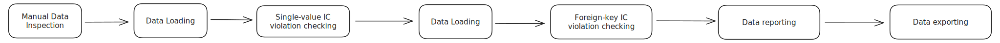
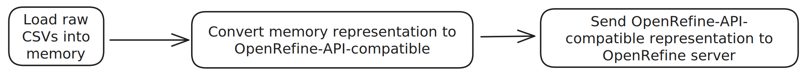
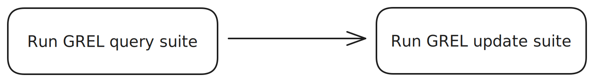

# CS 513 Group Project, Part 2

**Team ID**: 37

__Team Name__: PADS

Aaron Schlesinger and David Pankros 

{aschle2, pankros2}@illinois.edu

## 1. Description of Data Cleaning Performed

### Identify and describe all (high-level) data cleaning steps you have performed.

We've used OpenRefine and a SQL database together to achieve data cleaning outcomes that are more complex than OpenRefine would easily allow us to do on its own. We've also managed to build a Python client for OpenRefine's API. Instead of using the OpenRefine dashboard to perform data cleaning steps visually with the point-and-click user interface, we're able to integrate all our data cleaning steps, listed below, into a single Python program that can be run from the command line.

- Raw CSV manipulation
- Loading CSV data into OpenRefine
- Manipulating data in OpenRefine
- Loading partially-cleaned data into the SQL database
- Constructing specific views of data in SQL
- Manipulating data in SQL
- Exporting cleaned data from SQL to final, cleaned data in CSV format

The result of the single, unified Python program is that we have the ability to run our entire workflow, including all outer and inner workflow steps, with a single command. This ability to run the entire workflow with a single command is a significant advantage over running the workflow manually, step-by-step, in OpenRefine and SQL and gives us the ability to easily reproduce our results.

### For each high-level data cleaning step you have performed, explain its rationale. Was the step really required to support use case U1? Explain. If not, explain why those steps were still useful.

For context, use case `U1` is summarized as using standard data cleaning techniques to produce data to be used for non-production-critical applications, data mining, unsupervised learning, or possibly further analysis and manipulation to use cleaner subsets of the entire dataset for additional purposes.

We have listed the high-level data cleaning steps in the introduction to this section. We will re-list them below and explain the rationale for each step.

#### Step 1: Raw CSV manipulation

This step is primarily loading CSV data into memory, for the purpose of subsequently loading it into OpenRefine. We do no data cleaning in this step, but it is necessary to support all the subsequent steps.

#### Step 2: Loading CSV data into OpenRefine

Similarly to the previous step, we do not perform any data cleaning in this step. Loading data into OpenRefine is necessary to support all OpenRefine-based and subsequent cleaning steps.

#### Step 3: Manipulating data in OpenRefine

After data are loaded into OpenRefine, we do many data cleaning steps that do not involve foreign key or other relational integrity constraint (IC) violations. All transforms are done with OpenRefine's [GREL language](https://openrefine.org/docs/manual/grelfunctions).

These transforms are necessary for use case `U1` because they greatly improve the standardization and cleanliness of individual fields in the dataset, which is important for all `U1` applications, but especially user-facing ones. They also better prepare the data to be analyzed and manipulated further, another `U1` goal. The transforms we do in this step correspond to some, but not all of the IC violations in the [`part_2/ic.md`](https://github.com/dpankros/uiuc_cs513_project/blob/main/part_2/ic.md) file in the repository, so we make progress toward completing our IC violations checks in this step.

We also perform crucial data cleaning that is unrelated to our IC violations checks, but does enable us to complete additional IC violations checks in subsequent steps. For example, one of the non-IC cleaning steps we take herein establishes a common vocabulary for the `Menu.venue` column and transforms all uncleaned values in that column to that common vocabulary. This step allows us to group by values in this column much more effectively in subsequent steps.

##### List of IC violations checks

###### `Dish`

- id must be populated and unique
- name must be populated
- menus_appeared should be greater than 0
- times_appeared should be greater than 0
- first appeared should be between (?? and NOW)
- last appeared should be between (?? and NOW)
- lowest_price should be > 0
- highest_price should not be null and should be > lowest_price

###### `Menu`

- id must be populated and unique
- name must be populated
- sponsor
- event
- venue
- place
- physical_description must be a list of string demlimited by semicolons
- occasion
- notes
- call_number
- keywords
- language
- date must be in iso8601 format
- location
- location_type
- currency
- currency_symbol
- status must be one of the two values
- page_count > 0
- dish_count > 0

###### `MenuPage`
- id must be populated and unique
- menu_id must be defined and menu.id must exist
- page_number
- image_id
- full_height Must be > 0
- full_width Must be > 0
- uuid

###### `MenuItem`

- id must be populated and unique
- menu_page_id must be defined and menu_page.id must exist
- price > 0 or null
- high_price
- dish_id must exist
- created_at should be in iso8601 format.  Must be defined.  Must be <= NOW
- updated_at should be in iso8601 format Must be <= NOW
- xpos
- ypos

#### Step 4: Loading partially-cleaned data into the SQL database

After we finish running all the GREL/OpenRefine-based transforms, we consider our data partially cleaned, since we have not addressed relational IC violations like foreign key constraints. Since SQL excels at analyzing, reporting on, and fixing these relational IC violations, our next step is to load all our partially-cleaned data from OpenRefine into a SQLite database.

We do no cleaning in this step, but it's necessary for our subsequent foreign key IC violations cleaning work.

#### Step 5: Constructing specific views of data in SQL

After loading our partially-cleaned data into the SQL database, we construct specific views of the data that allow us to analyze and report on the data in ways that are possible in neither OpenRefine, nor the raw `Menu`, `Dish`, `MenuItem`, nor `MenuPage` tables individually. Most of these views are constructed by joining at two or more of these tables together to examine one or more specific foreign key relationships.

Using these views, we're able to easily identify and fix all rows that violate a specific foreign key IC violation. We do no actual data cleaning in this step, but like the previous step, this step is required for subsequent foreign key IC violations cleaning work.

#### Step 6: Manipulating data in SQL

Armed with partially-cleaned data in our "base" `Menu`, `Dish`, `MenuItem`, and `MenuPage` tables and our constructed views, we can now fix foreign key IC violations based on some policy. Policies vary, but in general, we want to ensure that all foreign key relationships are valid, so if we find an invalid foreign key, we simply set that value to `NULL`.

This work is necessary for use case `U1` because it ensures there are no invalid foreign key relationships in the dataset, a feature especially valuable for the user-facing applications described in `U1` or any other application that queries or analyzes these data based on relationships between tables.

#### Step 7: Exporting cleaned data from SQL to final, cleaned data in CSV format

This final step is relatively simple, but critical to transform our cleaned dataset to the same format in which we got it. At this point, we have a cleaned dataset in SQL tables and in this step, we export these tables to individual CSV files. The mapping from SQL table to exported CSV files is as follows:

- `menu` -> `Menu.export.csv`
- `dish` -> `Dish.export.csv`
- `menu_item` -> `MenuItem.export.csv`
- `menu_page` -> `MenuPage.export.csv`

## 2. Document data quality changes

### Quantify the results of your efforts, e.g., by providing a summary table of changes: Which columns changed? How many cells (per column) have changed, etc.?

The below table contains a summary of the changes our cleaning software made to the dataset. Full output from these runs can be found in the [`runs/`](https://github.com/dpankros/uiuc_cs513_project/tree/main/runs) directory in the repository. One individual run is stored in each file therein, and file names indicate the date and time the run was completed. The structure of a filename is as follows:

```text
YYYY-MM-DD.HH-MM-SSZUTC.csv
```

TODO: This table needs to be double-checked for completeness and accuracy

| Data entity | # IC violations before cleaning | # IC violations after cleaning | Columns with IC violations |
| -- | -- | -- | -- |
| `MenuItem` | 370 | 0 | `price`, `dish_id` |
| `MenuPage` | 5803 | 0 | `menu_id` |
| `Dish` | 67668 | 0 | `first_appeared`, `last_appeared`, `times_appeared` |
| `Menu` | 17541 | 0 | `menu_id`, `full_height`, `full_width`, `page_count` |


### Demonstrate that data quality has been improved, e.g., by devising IC-violation reports (answers to denial constraints) and showing the difference between number of IC violations reported before and after cleaning.

As indicated previously, our Python application contains a wide range of IC checks and thus generates IC violation reports for all checks. The list of IC checks can be found at [`part_2/ic.md`](https://github.com/dpankros/uiuc_cs513_project/blob/main/part_2/ic.md) in the project repository. The table in the previous section shows the number of IC violations before and after cleaning and thus quantitatively demonstrates that data quality is improved.

## 3. Create a workflow model

### A visual representation of your overall (or “outer”) workflow W1, e.g., using a tool such as YesWorkflow. At a minimum, you should identify key inputs, outputs, and steps of the workflow, along with dependencies between these. Key phases and steps of your data cleaning project may include, e.g., data profiling, data loading, data cleaning, IC violation checks, etc. Explain the design of W1 and why you’ve chosen the tools that you have in your overall workflow.

A visual representation of our outer workflow is shown as follows:



>This file can be seen enlarged at [diagrams/OuterWorkflow.svg](https://github.com/dpankros/uiuc_cs513_project/blob/main/diagrams/OuterWorkflow.svg) in SVG format, or [diagrams/OuterWorklow.png](https://github.com/dpankros/uiuc_cs513_project/blob/main/diagrams/OuterWorkflow.png) in PNG format.

### A detailed (possibly visual) representation of your “inner” data cleaning workflow W2 (e.g., if you’ve used OpenRefine, you can use the OR2YW tool).

Since our entire outer workflow is written in Python, the inner workflow is precisely and entirely captured with code and can be seen in the [`part_2/cleaning-suite` directory](https://github.com/dpankros/uiuc_cs513_project/tree/main/part_2/cleaning-suite) in the repository. To summarize what's going on with our Python code, we have provided inner workflow diagrams below for each outer workflow stage.

#### Manual Data Inspection


#### Data Loading (1)



#### Single-value IC violation checks



#### Data loading (2)


#### Foreign-key IC violation checking


#### Data exporting


## 4. Conclusions & Summary

### Please provide a concise summary and conclusions of your project, including lessons learned.

In this project, we've primarily learned that the functionality offered by the suite of data cleaning tools introduced in this class are lacking in some areas. 

For example, OpenRefine is excellent at cleaning data, but it's not great at enforcing relational ICs. SQL is excellent at enforcing relational ICs, but it's not designed for data cleaning tasks. While combining OpenRefine and SQL together is powerful, it still lacks the power needed to process even modestly-sized datasets like the NYPL restaurants dataset we used. For that, we estimate that a distributed data cleaning tool like Apache Spark or similar would be necessary.

Nevertheless, we believe we were successful in cleaning this restaurants dataset according to use case `U1` described in our part 1 submission, and as such it could be used to power non-mission-critical, data mining, and unsupervised learning applications. Also, further analysis could be done to identify superior-quality subsets of these data for use in other, more mission-critical applications.

We were also able to create a Python application that allows us to perform cleaning on _any_ similar dataset with the same format. As described previously, this application is easily run with a single command and allows us to reliably and deterministically reproduce our data cleaning runs. We believe this method is significantly more efficient and robust than running the workflow manually, step-by-step, in OpenRefine and SQL.

### Reflect on how work was completed. You should summarize the contributions of each team member here (for teams with >= 2 members).

Aaron Schlesinger and David Pankros worked together on this project. The work was completed as follows:

- Aaron: evaluation library and integrity checking
- Aaron: Python CLI application infrastructure
- Aaron and Dave: writeup and documentation
- Dave: OpenRefine API client and single-column IC violation checks
- Dave: SQL views and Foreign Key IC violation checks
- Dave: cleaning framework and infrastructure

## 5. Submission of supplementary materials in a single ZIP file

- Workflow model
- Operation history
  - OpenRefine recipe
  - Other scripts, provenance files
- Queries
- Original ("dirty") and cleaned datasets
  - Please provide an **accessible** Box folder link in a plain text file: `DataLinks.txt`
